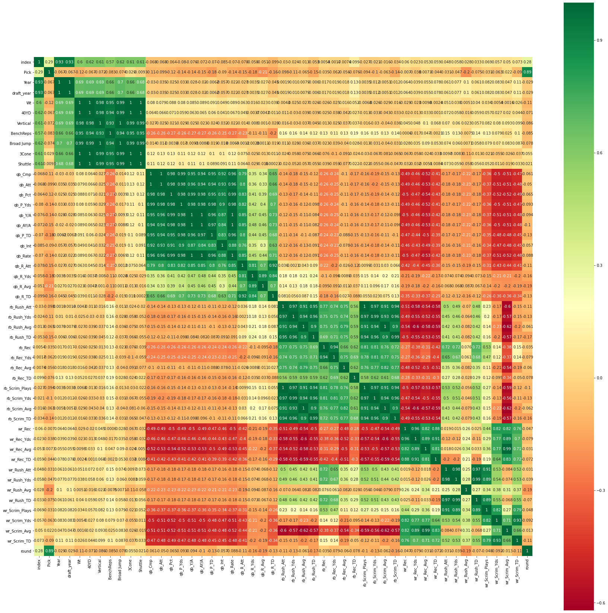
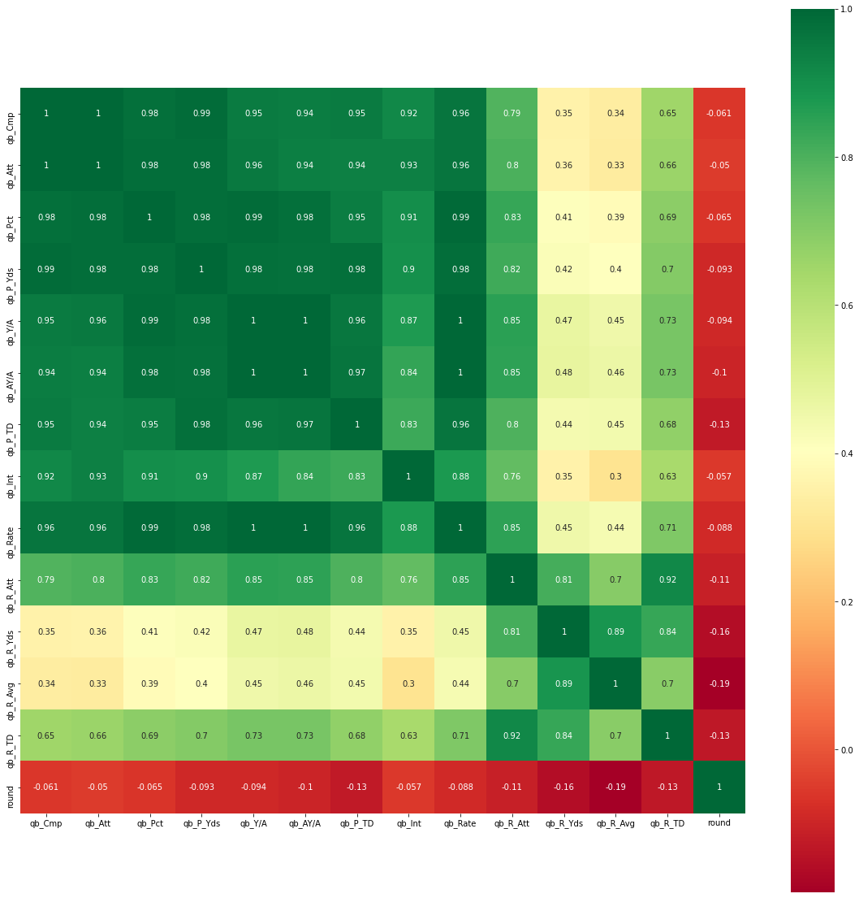
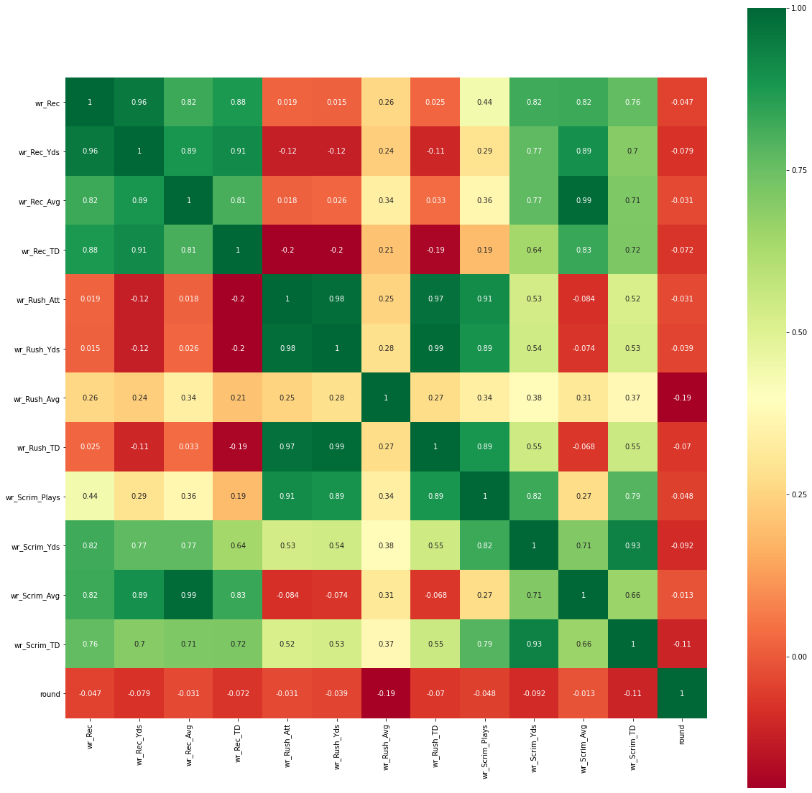
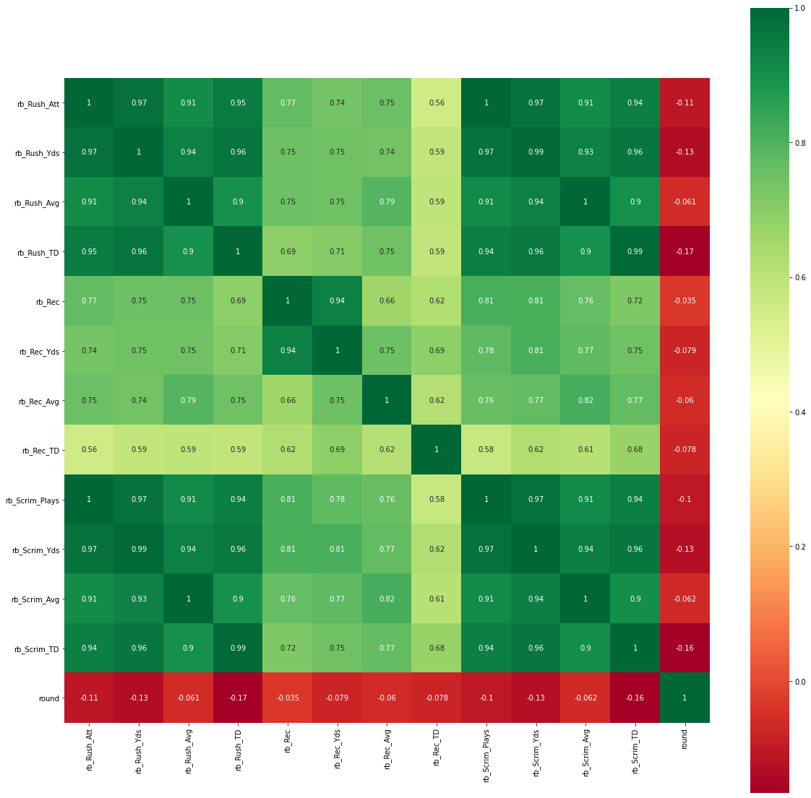
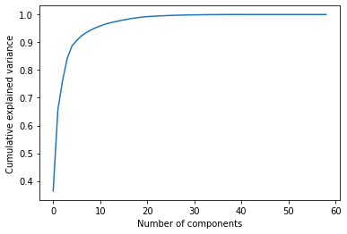
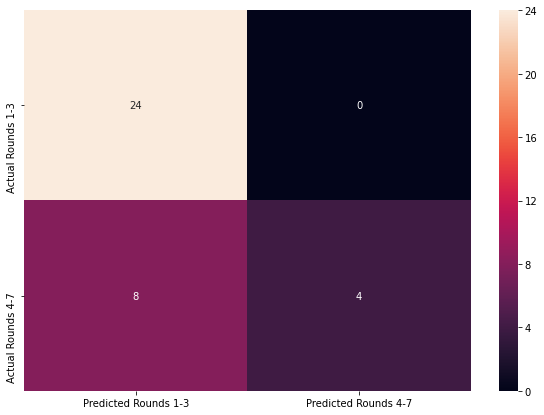

# NFL Draft Predictions: Part 2 Feature Engineering and Modeling
##### By Elizabeth Khan

## Goal: To predict which round a Quarterback, Wide Reciever, or Running Back will be drafted to the NFL  based on the player's performance throughout the regular season. 


### In this notebook I will be covering the feature engineering and the modeling process for this dataset. If you wish to learn more about the web scraping and data cleansing please proceed to the other Jupyter Notebook located here. The csv loaded in this dataset was created from the Part 1 notebook from the sports-reference.com website.

### Based on my knowledge of football these are the metrics that I  may want to start with:
### Potential QB Metrics
1. Passing Yards (Yds)
2. Touch down to interception Ratio
3. Yards Per Attempt (Y/A)
4. Passer Efficiency Rating (Rate)
5. Completion Rate (Pct = Cmp/Att)

### Potential WR Metrics
1. Recieving Yards Per Reception
2. Receptions
3. Receiving Touchdowns

### Potential RB Metrics
1. Average Yards Per Rush
2. Rushing Yards
3. Rushing Touchdowns

## First I am going to review a correlation matrix to see which features have the highest correlation to the draft round.

### Step 1: Correlation Matrix to understand which features have the strongest correlation with the feature I am trying to predict: Round


```python
### Import Standard Packages and Machine Learning Models from sklearn and XGBoost
```


```python
# Import Basic Libraries
import pandas as pd
import numpy as np
import os 
import csv
import math
import datetime
import matplotlib as mpl
import matplotlib.pyplot as plt
import seaborn as sns
%matplotlib inline

#Import Machine Learning Models from Sklearn
from sklearn.preprocessing import OneHotEncoder
from sklearn.preprocessing import StandardScaler
from sklearn.decomposition import PCA
from sklearn.model_selection import train_test_split, KFold
from sklearn import preprocessing
from sklearn.linear_model import LogisticRegression
from sklearn.neighbors import KNeighborsClassifier
from sklearn.model_selection import GridSearchCV, cross_val_score, RepeatedStratifiedKFold
from sklearn import svm
from sklearn.ensemble import RandomForestClassifier
from sklearn.datasets import make_classification

#Gradient Boosting
from sklearn import ensemble
import xgboost as xgb

#Evaluate Model accuracy
from sklearn.metrics import classification_report
from sklearn.metrics import accuracy_score, confusion_matrix
from keras.models import Sequential
from keras.layers import Dense
from keras.wrappers.scikit_learn import KerasClassifier
from keras.callbacks import EarlyStopping
import keras 
model = Sequential()

#Measure Programes execution time
import time

#start script
script_start = time.time()
```

  
    


```python
complete = pd.read_csv('complete_nfl_draft_predictions_dataset_2017_2019.csv')
complete.describe()
```


<div>
<style scoped>
    .dataframe tbody tr th:only-of-type {
        vertical-align: middle;
    }

    .dataframe tbody tr th {
        vertical-align: top;
    }

    .dataframe thead th {
        text-align: right;
    }
</style>
<table border="1" class="dataframe">
  <thead>
    <tr style="text-align: right;">
      <th></th>
      <th>index</th>
      <th>Pick</th>
      <th>Year</th>
      <th>draft_year</th>
      <th>Wt</th>
      <th>40YD</th>
      <th>Vertical</th>
      <th>BenchReps</th>
      <th>Broad Jump</th>
      <th>3Cone</th>
      <th>...</th>
      <th>wr_Rec_Avg</th>
      <th>wr_Rec_TD</th>
      <th>wr_Rush_Att</th>
      <th>wr_Rush_Yds</th>
      <th>wr_Rush_Avg</th>
      <th>wr_Rush_TD</th>
      <th>wr_Scrim_Plays</th>
      <th>wr_Scrim_Yds</th>
      <th>wr_Scrim_Avg</th>
      <th>wr_Scrim_TD</th>
    </tr>
  </thead>
  <tbody>
    <tr>
      <th>count</th>
      <td>180.000000</td>
      <td>180.000000</td>
      <td>180.000000</td>
      <td>180.000000</td>
      <td>180.000000</td>
      <td>160.000000</td>
      <td>161.000000</td>
      <td>138.000000</td>
      <td>157.000000</td>
      <td>127.000000</td>
      <td>...</td>
      <td>180.000000</td>
      <td>180.000000</td>
      <td>180.000000</td>
      <td>180.000000</td>
      <td>180.000000</td>
      <td>180.000000</td>
      <td>180.00000</td>
      <td>180.000000</td>
      <td>180.000000</td>
      <td>180.000000</td>
    </tr>
    <tr>
      <th>mean</th>
      <td>430.805556</td>
      <td>122.711111</td>
      <td>2010.022222</td>
      <td>2011.022222</td>
      <td>128.950000</td>
      <td>2.561688</td>
      <td>19.990683</td>
      <td>8.601449</td>
      <td>67.464968</td>
      <td>3.199055</td>
      <td>...</td>
      <td>8.576111</td>
      <td>4.350000</td>
      <td>26.766667</td>
      <td>147.888889</td>
      <td>2.344444</td>
      <td>1.516667</td>
      <td>62.00000</td>
      <td>654.600000</td>
      <td>8.048889</td>
      <td>5.866667</td>
    </tr>
    <tr>
      <th>std</th>
      <td>265.805660</td>
      <td>77.103318</td>
      <td>0.818471</td>
      <td>0.818471</td>
      <td>103.776203</td>
      <td>2.269503</td>
      <td>17.807519</td>
      <td>9.299980</td>
      <td>60.958953</td>
      <td>3.561311</td>
      <td>...</td>
      <td>7.523537</td>
      <td>4.835247</td>
      <td>70.420057</td>
      <td>389.606389</td>
      <td>4.843301</td>
      <td>4.029881</td>
      <td>78.41417</td>
      <td>601.024754</td>
      <td>7.315748</td>
      <td>5.683850</td>
    </tr>
    <tr>
      <th>min</th>
      <td>0.000000</td>
      <td>1.000000</td>
      <td>2009.000000</td>
      <td>2010.000000</td>
      <td>0.000000</td>
      <td>0.000000</td>
      <td>0.000000</td>
      <td>0.000000</td>
      <td>0.000000</td>
      <td>0.000000</td>
      <td>...</td>
      <td>0.000000</td>
      <td>0.000000</td>
      <td>0.000000</td>
      <td>-7.000000</td>
      <td>-3.500000</td>
      <td>0.000000</td>
      <td>0.00000</td>
      <td>0.000000</td>
      <td>0.000000</td>
      <td>0.000000</td>
    </tr>
    <tr>
      <th>25%</th>
      <td>208.750000</td>
      <td>52.750000</td>
      <td>2009.000000</td>
      <td>2010.000000</td>
      <td>0.000000</td>
      <td>0.000000</td>
      <td>0.000000</td>
      <td>0.000000</td>
      <td>0.000000</td>
      <td>0.000000</td>
      <td>...</td>
      <td>0.000000</td>
      <td>0.000000</td>
      <td>0.000000</td>
      <td>0.000000</td>
      <td>0.000000</td>
      <td>0.000000</td>
      <td>0.00000</td>
      <td>0.000000</td>
      <td>0.000000</td>
      <td>0.000000</td>
    </tr>
    <tr>
      <th>50%</th>
      <td>416.500000</td>
      <td>122.000000</td>
      <td>2010.000000</td>
      <td>2011.000000</td>
      <td>198.500000</td>
      <td>4.390000</td>
      <td>30.000000</td>
      <td>0.000000</td>
      <td>112.000000</td>
      <td>0.000000</td>
      <td>...</td>
      <td>10.300000</td>
      <td>2.000000</td>
      <td>0.000000</td>
      <td>0.000000</td>
      <td>0.000000</td>
      <td>0.000000</td>
      <td>50.50000</td>
      <td>686.500000</td>
      <td>7.700000</td>
      <td>6.000000</td>
    </tr>
    <tr>
      <th>75%</th>
      <td>634.250000</td>
      <td>191.750000</td>
      <td>2011.000000</td>
      <td>2012.000000</td>
      <td>216.000000</td>
      <td>4.550000</td>
      <td>36.000000</td>
      <td>17.000000</td>
      <td>123.000000</td>
      <td>7.075000</td>
      <td>...</td>
      <td>15.225000</td>
      <td>8.000000</td>
      <td>5.000000</td>
      <td>23.250000</td>
      <td>4.325000</td>
      <td>0.000000</td>
      <td>77.25000</td>
      <td>1173.000000</td>
      <td>14.725000</td>
      <td>10.000000</td>
    </tr>
    <tr>
      <th>max</th>
      <td>925.000000</td>
      <td>256.000000</td>
      <td>2011.000000</td>
      <td>2012.000000</td>
      <td>247.000000</td>
      <td>5.090000</td>
      <td>44.500000</td>
      <td>27.000000</td>
      <td>140.000000</td>
      <td>7.530000</td>
      <td>...</td>
      <td>23.100000</td>
      <td>18.000000</td>
      <td>302.000000</td>
      <td>1760.000000</td>
      <td>37.500000</td>
      <td>18.000000</td>
      <td>331.00000</td>
      <td>2038.000000</td>
      <td>23.100000</td>
      <td>21.000000</td>
    </tr>
  </tbody>
</table>
<p>8 rows × 48 columns</p>
</div>


```python
# Function to convert Pick into draft round (0= Rounds 1-3) (1= rounds 4-7)
def create_round(pick):
    if (pick>=1) & (pick<=32):
        return 0
    elif (pick>32) & (pick<=64):
        return 0
    elif (pick>64) & (pick<=106):
        return 0
    elif (pick>106) & (pick<=146):
        return 1
    elif (pick>146) & (pick<=179):
        return 1
    elif (pick>179) & (pick<=214):
        return 1
    else:
        return 1
    
    

complete['round'] = complete.apply(lambda row: create_round(row['Pick']),axis=1)
```


```python
complete.head()
```


<div>
<style scoped>
    .dataframe tbody tr th:only-of-type {
        vertical-align: middle;
    }

    .dataframe tbody tr th {
        vertical-align: top;
    }

    .dataframe thead th {
        text-align: right;
    }
</style>
<table border="1" class="dataframe">
  <thead>
    <tr style="text-align: right;">
      <th></th>
      <th>index</th>
      <th>Pick</th>
      <th>NFLTeam</th>
      <th>Pos</th>
      <th>Player</th>
      <th>Year</th>
      <th>draft_year</th>
      <th>School</th>
      <th>Height</th>
      <th>Wt</th>
      <th>...</th>
      <th>wr_Rec_TD</th>
      <th>wr_Rush_Att</th>
      <th>wr_Rush_Yds</th>
      <th>wr_Rush_Avg</th>
      <th>wr_Rush_TD</th>
      <th>wr_Scrim_Plays</th>
      <th>wr_Scrim_Yds</th>
      <th>wr_Scrim_Avg</th>
      <th>wr_Scrim_TD</th>
      <th>round</th>
    </tr>
  </thead>
  <tbody>
    <tr>
      <th>0</th>
      <td>0</td>
      <td>1</td>
      <td>CLE</td>
      <td>QB</td>
      <td>Baker Mayfield</td>
      <td>2009</td>
      <td>2010</td>
      <td>0</td>
      <td>0</td>
      <td>0</td>
      <td>...</td>
      <td>0.0</td>
      <td>0.0</td>
      <td>0.0</td>
      <td>0.0</td>
      <td>0.0</td>
      <td>0.0</td>
      <td>0.0</td>
      <td>0.0</td>
      <td>0.0</td>
      <td>0</td>
    </tr>
    <tr>
      <th>1</th>
      <td>1</td>
      <td>2</td>
      <td>NYG</td>
      <td>RB</td>
      <td>Saquon Barkley</td>
      <td>2009</td>
      <td>2010</td>
      <td>0</td>
      <td>0</td>
      <td>0</td>
      <td>...</td>
      <td>3.0</td>
      <td>217.0</td>
      <td>1271.0</td>
      <td>5.9</td>
      <td>18.0</td>
      <td>271.0</td>
      <td>1903.0</td>
      <td>7.0</td>
      <td>21.0</td>
      <td>0</td>
    </tr>
    <tr>
      <th>2</th>
      <td>2</td>
      <td>3</td>
      <td>NYJ</td>
      <td>QB</td>
      <td>Sam Darnold</td>
      <td>2009</td>
      <td>2010</td>
      <td>0</td>
      <td>0</td>
      <td>0</td>
      <td>...</td>
      <td>0.0</td>
      <td>0.0</td>
      <td>0.0</td>
      <td>0.0</td>
      <td>0.0</td>
      <td>0.0</td>
      <td>0.0</td>
      <td>0.0</td>
      <td>0.0</td>
      <td>0</td>
    </tr>
    <tr>
      <th>3</th>
      <td>6</td>
      <td>7</td>
      <td>BUF</td>
      <td>QB</td>
      <td>Josh Allen</td>
      <td>2009</td>
      <td>2010</td>
      <td>0</td>
      <td>0</td>
      <td>0</td>
      <td>...</td>
      <td>0.0</td>
      <td>0.0</td>
      <td>0.0</td>
      <td>0.0</td>
      <td>0.0</td>
      <td>0.0</td>
      <td>0.0</td>
      <td>0.0</td>
      <td>0.0</td>
      <td>0</td>
    </tr>
    <tr>
      <th>4</th>
      <td>9</td>
      <td>10</td>
      <td>ARI</td>
      <td>QB</td>
      <td>Josh Rosen</td>
      <td>2009</td>
      <td>2010</td>
      <td>0</td>
      <td>0</td>
      <td>0</td>
      <td>...</td>
      <td>0.0</td>
      <td>0.0</td>
      <td>0.0</td>
      <td>0.0</td>
      <td>0.0</td>
      <td>0.0</td>
      <td>0.0</td>
      <td>0.0</td>
      <td>0.0</td>
      <td>0</td>
    </tr>
  </tbody>
</table>
<p>5 rows × 54 columns</p>
</div>


### Results of Correlation Matrix
The more correlated two features are the closer they will be to 1 or -1. The correlation matrix below shows that there is a strong relationship between features related to a player's position (i.e. the features related to the quarterback tend to have a moderate to strong correlation .3 to .98). The draft, however, does not correlate to any of the positional categories but this could be due to the fact if the qb stats are populated the wr and rb stats will not be and so forth.


```python
correlation = complete.corr()
plt.figure(figsize=(30,30))
sns.heatmap(correlation, vmax=1, square=True,annot=True,cmap='RdYlGn')
```


    <matplotlib.axes._subplots.AxesSubplot at 0x23b11ce6608>





```python
# Let's get the positional metrics and look at the correlation matrix by position
qb_cols = list(complete.filter(regex='^qb',axis=1).columns)
qb_cols.append('round')

wr_cols = list(complete.filter(regex='^wr',axis=1).columns)
wr_cols.append('round')

rb_cols = list(complete.filter(regex='^rb',axis=1).columns)
rb_cols.append('round')

```

### QB Correlation Matrix
There do not appear to be an base features that are strongly correlated to the round a quarterback is drafted. However, the feature with the strongest correlation appears to be the rushing average (-.2) followed by the rushing yards (-.18) and touchdown passes (-.17). Also there are quite a few features here that are highly correlated to each other so I will try to apply some feature reduction for features that are similar (PCA).


```python
correlation = complete[qb_cols].corr()
plt.figure(figsize=(20,20))
sns.heatmap(correlation, vmax=1, square=True,annot=True,cmap='RdYlGn')
```


    <matplotlib.axes._subplots.AxesSubplot at 0x23b1c8d28c8>





### WR Correlation Matrix

The rushing average is by far the strongest correlation with the draft round at -.19. I may need to do some feature engineering here to create a new feature using a combination of the stats for Wide Receivers.


```python
correlation = complete[wr_cols].corr()
plt.figure(figsize=(20,20))
sns.heatmap(correlation, vmax=1, square=True,annot=True,cmap='RdYlGn')
```


    <matplotlib.axes._subplots.AxesSubplot at 0x23b1ca5fa08>





### RB Correlation Matrix

The rushing touch downs and scrimmage touch downs are the features most correlated to the draft round at -.14 and -.13 respectively. All other features are moderately to highly correlated with one another and a feature reduction technique could be useful here as well.


```python
correlation = complete[rb_cols].corr()
plt.figure(figsize=(20,20))
sns.heatmap(correlation, vmax=1, square=True,annot=True,cmap='RdYlGn')
```


    <matplotlib.axes._subplots.AxesSubplot at 0x23b1cbba0c8>





### Step 2: Feature Engineering & Feature Selection
Now it's time to decide which features should go in the model and engineer new features that might be better predictors of what round a player is going to be drafted in.

### QB Features
1. Touchdown to interception ratio for the quarterback: The higher the ratio means the QB was able to maximize points scored while minimizing turnovers.
2. Passing Yards Score: The ratio of qb passing yards to the qb with max passing yards
3. Dual Threat Score: The ratio of qb passing and rushing yard to the qb with max pass yards and the qb with max rushing yards
4. QB Score: A qb score card based on percentage complete, passing yards, and rushing yards 


```python
complete['qb_tds'] = complete.qb_P_TD + complete.qb_R_TD 
```


```python
def qb_score(pct,rate,tds, pass_yds, rush_yds):
    if pct >= 69:
        pct_score = 100
    elif (pct<69) & (pct>=64):
        pct_score = 75
    elif (pct<64) & (pct>= 60):
        pct_score = 50 
    elif (pct<60) & (pct>= 58):
        pct_score = 25
    else:
        pct_score = 12.5
        
    if rate >= 175:
        rate_score = 100
    elif (rate<175) & (rate>=145):
        rate_score = 75
    elif (rate<145) & (rate>= 137):
        rate_score = 50 
    elif (rate<137) & (rate>= 124):
        rate_score = 25
    else:
        rate_score = 12.5
    
    if tds >= 40:
        tds_score = 100
    elif (tds<40) & (tds>= 30):
        tds_score = 75
    elif (tds<30) & (tds>= 24):
        tds_score = 50 
    elif (tds<24) & (tds>= 16):
        tds_score = 25
    else:
        tds_score = 12.5
        
    if pass_yds>= 4000:
        pass_yds_score = 100
    elif (pass_yds<4000) & (pass_yds>=3000):
        pass_yds_score = 95
    elif (pass_yds<3000) & (pass_yds>=2500):
        pass_yds_score = 90
    elif (pass_yds<2000) & (pass_yds>= 1000):
        pass_yds_score = 80
    else:
        pass_yds_score = 50
    
    if rush_yds>= 1000:
        rush_yds_score = 100
    elif (rush_yds<970) & (rush_yds>=400):
        rush_yds_score = 75
    elif (rush_yds<400) & (rush_yds>= 240): 
        rush_yds_score = 50 
    else:
        rush_yds_score = 25
    
    avg_pass_rush = (rush_yds_score + pass_yds_score)/2
    
    return (tds_score * .5) + (rate_score * .2) + (max(pass_yds_score,avg_pass_rush) * .3)    
     
```


```python
complete['qb_score'] = complete.apply(lambda row: qb_score(row['qb_Pct'], row['qb_Rate'], row['qb_tds'], row['qb_P_Yds'],row['qb_R_Yds']), axis=1)
```


```python
# Touchdown to interception ratio
complete['qb_td_to_interception_ratio'] = np.where(complete['Pos'] == 'QB', complete.qb_P_TD/ complete.qb_Int, 0)

# Passing Yards Score
complete['qb_passing_yards_score'] = np.where(complete['Pos'] == 'QB', complete.qb_P_Yds/ complete.qb_P_Yds.max(), 0)

# DualThreat Score
complete['qb_dual_threat_score'] = np.where(complete['Pos'] == 'QB', (complete.qb_P_Yds+complete.qb_R_Yds)/(complete.qb_P_Yds.max()+complete.qb_R_Yds.max()) , 0)
```

### WR Features
1. Percentage of receptions that were touch downs: Key wide receivers tend to have more receptions in the red zone.
2. Total Rushing and Receiving Average: Identifies dynamic wide receivers that can extend yardage using their rush game.
3. WR Score: a wide receiver scorecard based on receiving yards as well as receiving yards per attempt


```python
def wr_score (rec_yds, rec_avg):
#     if scrim_yds>= 1000:
#         scrim_yds_score = 100
#     elif (scrim_yds<1000) & (scrim_yds>=900):
#         scrim_yds_score = 95
#     elif (scrim_yds<900) & (scrim_yds>= 800):
#         scrim_yds_score = 90
#     else:
#         scrim_yds_score = 70
        
    if rec_yds>= 1000:
        rec_yds_score = 100
    elif (rec_yds<1000) & (rec_yds>=900):
        rec_yds_score = 95
    elif (rec_yds<900) & (rec_yds>= 800):
        rec_yds_score = 90
    else:
        rec_yds_score = 70
        
        
    if rec_avg>= 15:
        rec_avg_score = 100
    elif (rec_avg<15) & (rec_avg>=14):
        rec_avg_score = 95
    elif (rec_avg<14) & (rec_avg>=12):
        rec_avg_score = 90
    elif (rec_avg<12) & (rec_avg>= 10):
        rec_avg_score = 85
    else:
        rec_avg_score = 70

    return   (rec_yds_score *.6) + (rec_avg_score *.4)
    
    
    
```


```python
complete['wr_score'] = complete.apply(lambda row: wr_score(row['wr_Rec_Yds'], row['wr_Rec_Avg']), axis=1)
```


```python
complete [complete['wr_score'] ==100]
```


<div>
<style scoped>
    .dataframe tbody tr th:only-of-type {
        vertical-align: middle;
    }

    .dataframe tbody tr th {
        vertical-align: top;
    }

    .dataframe thead th {
        text-align: right;
    }
</style>
<table border="1" class="dataframe">
  <thead>
    <tr style="text-align: right;">
      <th></th>
      <th>index</th>
      <th>Pick</th>
      <th>NFLTeam</th>
      <th>Pos</th>
      <th>Player</th>
      <th>Year</th>
      <th>draft_year</th>
      <th>School</th>
      <th>Height</th>
      <th>Wt</th>
      <th>...</th>
      <th>wr_Scrim_Yds</th>
      <th>wr_Scrim_Avg</th>
      <th>wr_Scrim_TD</th>
      <th>round</th>
      <th>qb_tds</th>
      <th>qb_score</th>
      <th>qb_td_to_interception_ratio</th>
      <th>qb_passing_yards_score</th>
      <th>qb_dual_threat_score</th>
      <th>wr_score</th>
    </tr>
  </thead>
  <tbody>
    <tr>
      <th>12</th>
      <td>39</td>
      <td>40</td>
      <td>DEN</td>
      <td>WR</td>
      <td>Courtland Sutton</td>
      <td>2009</td>
      <td>2010</td>
      <td>0</td>
      <td>0</td>
      <td>0</td>
      <td>...</td>
      <td>1087.0</td>
      <td>15.8</td>
      <td>13.0</td>
      <td>0</td>
      <td>0.0</td>
      <td>23.75</td>
      <td>0.0</td>
      <td>0.0</td>
      <td>0.0</td>
      <td>100.0</td>
    </tr>
    <tr>
      <th>16</th>
      <td>51</td>
      <td>51</td>
      <td>CHI</td>
      <td>WR</td>
      <td>Anthony Miller</td>
      <td>2009</td>
      <td>2010</td>
      <td>0</td>
      <td>0</td>
      <td>0</td>
      <td>...</td>
      <td>1487.0</td>
      <td>14.0</td>
      <td>18.0</td>
      <td>0</td>
      <td>0.0</td>
      <td>23.75</td>
      <td>0.0</td>
      <td>0.0</td>
      <td>0.0</td>
      <td>100.0</td>
    </tr>
    <tr>
      <th>18</th>
      <td>60</td>
      <td>60</td>
      <td>PIT</td>
      <td>WR</td>
      <td>James Washington</td>
      <td>2009</td>
      <td>2010</td>
      <td>0</td>
      <td>0</td>
      <td>0</td>
      <td>...</td>
      <td>1561.0</td>
      <td>20.3</td>
      <td>14.0</td>
      <td>0</td>
      <td>0.0</td>
      <td>23.75</td>
      <td>0.0</td>
      <td>0.0</td>
      <td>0.0</td>
      <td>100.0</td>
    </tr>
    <tr>
      <th>23</th>
      <td>91</td>
      <td>91</td>
      <td>NOR</td>
      <td>WR</td>
      <td>TreQuan Smith</td>
      <td>2009</td>
      <td>2010</td>
      <td>0</td>
      <td>0</td>
      <td>0</td>
      <td>...</td>
      <td>1194.0</td>
      <td>18.7</td>
      <td>14.0</td>
      <td>0</td>
      <td>0.0</td>
      <td>23.75</td>
      <td>0.0</td>
      <td>0.0</td>
      <td>0.0</td>
      <td>100.0</td>
    </tr>
    <tr>
      <th>24</th>
      <td>103</td>
      <td>103</td>
      <td>HOU</td>
      <td>WR</td>
      <td>Keke Coutee</td>
      <td>2009</td>
      <td>2010</td>
      <td>0</td>
      <td>0</td>
      <td>0</td>
      <td>...</td>
      <td>1444.0</td>
      <td>14.7</td>
      <td>10.0</td>
      <td>0</td>
      <td>0.0</td>
      <td>23.75</td>
      <td>0.0</td>
      <td>0.0</td>
      <td>0.0</td>
      <td>100.0</td>
    </tr>
    <tr>
      <th>30</th>
      <td>134</td>
      <td>133</td>
      <td>GNB</td>
      <td>WR</td>
      <td>JMon Moore</td>
      <td>2009</td>
      <td>2010</td>
      <td>0</td>
      <td>0</td>
      <td>0</td>
      <td>...</td>
      <td>1082.0</td>
      <td>16.6</td>
      <td>10.0</td>
      <td>1</td>
      <td>0.0</td>
      <td>23.75</td>
      <td>0.0</td>
      <td>0.0</td>
      <td>0.0</td>
      <td>100.0</td>
    </tr>
    <tr>
      <th>32</th>
      <td>163</td>
      <td>162</td>
      <td>BAL</td>
      <td>WR</td>
      <td>Jordan Lasley</td>
      <td>2009</td>
      <td>2010</td>
      <td>0</td>
      <td>0</td>
      <td>0</td>
      <td>...</td>
      <td>1258.0</td>
      <td>17.2</td>
      <td>9.0</td>
      <td>1</td>
      <td>0.0</td>
      <td>23.75</td>
      <td>0.0</td>
      <td>0.0</td>
      <td>0.0</td>
      <td>100.0</td>
    </tr>
    <tr>
      <th>45</th>
      <td>209</td>
      <td>208</td>
      <td>DAL</td>
      <td>WR</td>
      <td>Cedric Wilson</td>
      <td>2009</td>
      <td>2010</td>
      <td>Boise State</td>
      <td>6-2</td>
      <td>197</td>
      <td>...</td>
      <td>1524.0</td>
      <td>16.6</td>
      <td>7.0</td>
      <td>1</td>
      <td>0.0</td>
      <td>23.75</td>
      <td>0.0</td>
      <td>0.0</td>
      <td>0.0</td>
      <td>100.0</td>
    </tr>
    <tr>
      <th>51</th>
      <td>229</td>
      <td>228</td>
      <td>OAK</td>
      <td>WR</td>
      <td>Marcell Ateman</td>
      <td>2009</td>
      <td>2010</td>
      <td>0</td>
      <td>0</td>
      <td>0</td>
      <td>...</td>
      <td>1156.0</td>
      <td>19.6</td>
      <td>8.0</td>
      <td>1</td>
      <td>0.0</td>
      <td>23.75</td>
      <td>0.0</td>
      <td>0.0</td>
      <td>0.0</td>
      <td>100.0</td>
    </tr>
    <tr>
      <th>62</th>
      <td>287</td>
      <td>25</td>
      <td>BAL</td>
      <td>WR</td>
      <td>Marquise Brown</td>
      <td>2010</td>
      <td>2011</td>
      <td>Oklahoma</td>
      <td>5-9</td>
      <td>166</td>
      <td>...</td>
      <td>1318.0</td>
      <td>17.1</td>
      <td>10.0</td>
      <td>0</td>
      <td>0.0</td>
      <td>23.75</td>
      <td>0.0</td>
      <td>0.0</td>
      <td>0.0</td>
      <td>100.0</td>
    </tr>
    <tr>
      <th>66</th>
      <td>316</td>
      <td>51</td>
      <td>TEN</td>
      <td>WR</td>
      <td>AJ Brown</td>
      <td>2010</td>
      <td>2011</td>
      <td>Mississippi</td>
      <td>6-0</td>
      <td>226</td>
      <td>...</td>
      <td>1320.0</td>
      <td>15.5</td>
      <td>6.0</td>
      <td>0</td>
      <td>0.0</td>
      <td>23.75</td>
      <td>0.0</td>
      <td>0.0</td>
      <td>0.0</td>
      <td>100.0</td>
    </tr>
    <tr>
      <th>69</th>
      <td>323</td>
      <td>57</td>
      <td>PHI</td>
      <td>WR</td>
      <td>JJ ArcegaWhiteside</td>
      <td>2010</td>
      <td>2011</td>
      <td>Stanford</td>
      <td>6-2</td>
      <td>225</td>
      <td>...</td>
      <td>1059.0</td>
      <td>16.8</td>
      <td>14.0</td>
      <td>0</td>
      <td>0.0</td>
      <td>23.75</td>
      <td>0.0</td>
      <td>0.0</td>
      <td>0.0</td>
      <td>100.0</td>
    </tr>
    <tr>
      <th>71</th>
      <td>330</td>
      <td>62</td>
      <td>ARI</td>
      <td>WR</td>
      <td>Andy Isabella</td>
      <td>2010</td>
      <td>2011</td>
      <td>Massachusetts</td>
      <td>5-9</td>
      <td>188</td>
      <td>...</td>
      <td>1777.0</td>
      <td>15.7</td>
      <td>14.0</td>
      <td>0</td>
      <td>0.0</td>
      <td>23.75</td>
      <td>0.0</td>
      <td>0.0</td>
      <td>0.0</td>
      <td>100.0</td>
    </tr>
    <tr>
      <th>83</th>
      <td>384</td>
      <td>103</td>
      <td>ARI</td>
      <td>WR</td>
      <td>Hakeem Butler</td>
      <td>2010</td>
      <td>2011</td>
      <td>Iowa State</td>
      <td>6-5</td>
      <td>227</td>
      <td>...</td>
      <td>1318.0</td>
      <td>22.0</td>
      <td>9.0</td>
      <td>0</td>
      <td>0.0</td>
      <td>23.75</td>
      <td>0.0</td>
      <td>0.0</td>
      <td>0.0</td>
      <td>100.0</td>
    </tr>
    <tr>
      <th>100</th>
      <td>481</td>
      <td>184</td>
      <td>DET</td>
      <td>WR</td>
      <td>Travis Fulgham</td>
      <td>2010</td>
      <td>2011</td>
      <td>Old Dominion</td>
      <td>6-2</td>
      <td>215</td>
      <td>...</td>
      <td>1083.0</td>
      <td>17.2</td>
      <td>9.0</td>
      <td>1</td>
      <td>0.0</td>
      <td>23.75</td>
      <td>0.0</td>
      <td>0.0</td>
      <td>0.0</td>
      <td>100.0</td>
    </tr>
    <tr>
      <th>108</th>
      <td>512</td>
      <td>208</td>
      <td>TAM</td>
      <td>WR</td>
      <td>Scott Miller</td>
      <td>2010</td>
      <td>2011</td>
      <td>0</td>
      <td>0</td>
      <td>0</td>
      <td>...</td>
      <td>1164.0</td>
      <td>15.5</td>
      <td>9.0</td>
      <td>1</td>
      <td>0.0</td>
      <td>23.75</td>
      <td>0.0</td>
      <td>0.0</td>
      <td>0.0</td>
      <td>100.0</td>
    </tr>
    <tr>
      <th>114</th>
      <td>544</td>
      <td>236</td>
      <td>SEA</td>
      <td>WR</td>
      <td>John Ursua</td>
      <td>2010</td>
      <td>2011</td>
      <td>0</td>
      <td>0</td>
      <td>0</td>
      <td>...</td>
      <td>1347.0</td>
      <td>14.8</td>
      <td>17.0</td>
      <td>1</td>
      <td>0.0</td>
      <td>23.75</td>
      <td>0.0</td>
      <td>0.0</td>
      <td>0.0</td>
      <td>100.0</td>
    </tr>
    <tr>
      <th>116</th>
      <td>548</td>
      <td>239</td>
      <td>MIN</td>
      <td>WR</td>
      <td>Dillon Mitchell</td>
      <td>2010</td>
      <td>2011</td>
      <td>Oregon</td>
      <td>6-1</td>
      <td>197</td>
      <td>...</td>
      <td>1189.0</td>
      <td>15.6</td>
      <td>10.0</td>
      <td>1</td>
      <td>0.0</td>
      <td>23.75</td>
      <td>0.0</td>
      <td>0.0</td>
      <td>0.0</td>
      <td>100.0</td>
    </tr>
    <tr>
      <th>122</th>
      <td>586</td>
      <td>15</td>
      <td>DEN</td>
      <td>WR</td>
      <td>Jerry Jeudy</td>
      <td>2011</td>
      <td>2012</td>
      <td>Alabama</td>
      <td>6-1</td>
      <td>193</td>
      <td>...</td>
      <td>1164.0</td>
      <td>14.9</td>
      <td>10.0</td>
      <td>0</td>
      <td>0.0</td>
      <td>23.75</td>
      <td>0.0</td>
      <td>0.0</td>
      <td>0.0</td>
      <td>100.0</td>
    </tr>
    <tr>
      <th>123</th>
      <td>590</td>
      <td>17</td>
      <td>DAL</td>
      <td>WR</td>
      <td>CeeDee Lamb</td>
      <td>2011</td>
      <td>2012</td>
      <td>Oklahoma</td>
      <td>6-2</td>
      <td>198</td>
      <td>...</td>
      <td>1347.0</td>
      <td>19.0</td>
      <td>15.0</td>
      <td>0</td>
      <td>0.0</td>
      <td>23.75</td>
      <td>0.0</td>
      <td>0.0</td>
      <td>0.0</td>
      <td>100.0</td>
    </tr>
    <tr>
      <th>126</th>
      <td>602</td>
      <td>25</td>
      <td>SFO</td>
      <td>WR</td>
      <td>Brandon Aiyuk</td>
      <td>2011</td>
      <td>2012</td>
      <td>Arizona State</td>
      <td>6-0</td>
      <td>205</td>
      <td>...</td>
      <td>1198.0</td>
      <td>18.2</td>
      <td>8.0</td>
      <td>0</td>
      <td>0.0</td>
      <td>23.75</td>
      <td>0.0</td>
      <td>0.0</td>
      <td>0.0</td>
      <td>100.0</td>
    </tr>
    <tr>
      <th>129</th>
      <td>614</td>
      <td>33</td>
      <td>CIN</td>
      <td>WR</td>
      <td>Tee Higgins</td>
      <td>2011</td>
      <td>2012</td>
      <td>Clemson</td>
      <td>6-4</td>
      <td>216</td>
      <td>...</td>
      <td>1203.0</td>
      <td>20.1</td>
      <td>14.0</td>
      <td>0</td>
      <td>0.0</td>
      <td>23.75</td>
      <td>0.0</td>
      <td>0.0</td>
      <td>0.0</td>
      <td>100.0</td>
    </tr>
    <tr>
      <th>135</th>
      <td>638</td>
      <td>49</td>
      <td>PIT</td>
      <td>WR</td>
      <td>Chase Claypool</td>
      <td>2011</td>
      <td>2012</td>
      <td>Notre Dame</td>
      <td>6-4</td>
      <td>238</td>
      <td>...</td>
      <td>1037.0</td>
      <td>15.7</td>
      <td>13.0</td>
      <td>0</td>
      <td>0.0</td>
      <td>23.75</td>
      <td>0.0</td>
      <td>0.0</td>
      <td>0.0</td>
      <td>100.0</td>
    </tr>
    <tr>
      <th>140</th>
      <td>662</td>
      <td>59</td>
      <td>NYJ</td>
      <td>WR</td>
      <td>Denzel Mims</td>
      <td>2011</td>
      <td>2012</td>
      <td>Baylor</td>
      <td>6-3</td>
      <td>207</td>
      <td>...</td>
      <td>1020.0</td>
      <td>15.5</td>
      <td>12.0</td>
      <td>0</td>
      <td>0.0</td>
      <td>23.75</td>
      <td>0.0</td>
      <td>0.0</td>
      <td>0.0</td>
      <td>100.0</td>
    </tr>
    <tr>
      <th>153</th>
      <td>756</td>
      <td>128</td>
      <td>BUF</td>
      <td>WR</td>
      <td>Gabriel Davis</td>
      <td>2011</td>
      <td>2012</td>
      <td>UCF</td>
      <td>6-2</td>
      <td>216</td>
      <td>...</td>
      <td>1241.0</td>
      <td>17.2</td>
      <td>12.0</td>
      <td>1</td>
      <td>0.0</td>
      <td>23.75</td>
      <td>0.0</td>
      <td>0.0</td>
      <td>0.0</td>
      <td>100.0</td>
    </tr>
    <tr>
      <th>154</th>
      <td>774</td>
      <td>142</td>
      <td>WAS</td>
      <td>WR</td>
      <td>Antonio GandyGolden</td>
      <td>2011</td>
      <td>2012</td>
      <td>Liberty</td>
      <td>6-4</td>
      <td>223</td>
      <td>...</td>
      <td>1396.0</td>
      <td>17.7</td>
      <td>10.0</td>
      <td>1</td>
      <td>0.0</td>
      <td>23.75</td>
      <td>0.0</td>
      <td>0.0</td>
      <td>0.0</td>
      <td>100.0</td>
    </tr>
    <tr>
      <th>157</th>
      <td>797</td>
      <td>161</td>
      <td>TAM</td>
      <td>WR</td>
      <td>Tyler Johnson</td>
      <td>2011</td>
      <td>2012</td>
      <td>Minnesota</td>
      <td>6-1</td>
      <td>206</td>
      <td>...</td>
      <td>1317.0</td>
      <td>15.1</td>
      <td>13.0</td>
      <td>1</td>
      <td>0.0</td>
      <td>23.75</td>
      <td>0.0</td>
      <td>0.0</td>
      <td>0.0</td>
      <td>100.0</td>
    </tr>
    <tr>
      <th>167</th>
      <td>853</td>
      <td>200</td>
      <td>PHI</td>
      <td>WR</td>
      <td>Quez Watkins</td>
      <td>2011</td>
      <td>2012</td>
      <td>Southern Miss</td>
      <td>6-0</td>
      <td>185</td>
      <td>...</td>
      <td>1179.0</td>
      <td>18.1</td>
      <td>6.0</td>
      <td>1</td>
      <td>0.0</td>
      <td>23.75</td>
      <td>0.0</td>
      <td>0.0</td>
      <td>0.0</td>
      <td>100.0</td>
    </tr>
  </tbody>
</table>
<p>28 rows × 60 columns</p>
</div>


```python
# Percentage of receptions that were touch downs

complete['wr_TD_to_Rec_ratio'] = np.where(complete['Pos'] != 'QB', complete.qb_P_TD/ complete.wr_Rec, 0)

# Combined Average Yardage between receiving and rushing 

complete['wr_total_Avg_Rec_Rush'] = np.where(complete['Pos'] != 'QB', complete.wr_Rec_Avg + complete.wr_Rush_Avg , 0)

# Receiving yards score


complete['wr_rec_score'] = np.where(complete['Pos'] != 'QB', complete.wr_Rec_Yds/complete.wr_Rec_Yds.max() , 0)
```

### RB Features
1. Percentage of Rushing Touchdowns: Rushing Touchdowns to Total Touchdowns
2. Rushing Yards Score: The  ratio of rushing yards compared to the rb with the max rushing yards


```python
# Percentage of Rushing Touchdowns
complete['rb_rush_tds_ratio'] = np.where(complete['Pos'] != 'QB', complete.rb_Rush_TD/complete.rb_Scrim_TD , 0)
complete['rb_rush_score'] = np.where(complete['Pos'] != 'QB', complete.rb_Rush_Yds/complete.rb_Rush_Yds.max() , 0)
complete = complete.drop_duplicates()
complete.shape
```


    (180, 65)


```python
# complete = complete[complete['Pos']=='QB']
```

### Feature Selection and Preprocessing

I have too many features and need narrow it down and a few of these features are highly correlated. I will use Principal Component Analysis (PCA) to reduce the number of features within the feature space.


```python
# Create copy of dataset to identify features for model
features = complete.copy()
features.columns
```


    Index(['index', 'Pick', 'NFLTeam', 'Pos', 'Player', 'Year', 'draft_year',
           'School', 'Height', 'Wt', '40YD', 'Vertical', 'BenchReps', 'Broad Jump',
           '3Cone', 'Shuttle', 'qb_Cmp', 'qb_Att', 'qb_Pct', 'qb_P_Yds', 'qb_Y/A',
           'qb_AY/A', 'qb_P_TD', 'qb_Int', 'qb_Rate', 'qb_R_Att', 'qb_R_Yds',
           'qb_R_Avg', 'qb_R_TD', 'rb_Rush_Att', 'rb_Rush_Yds', 'rb_Rush_Avg',
           'rb_Rush_TD', 'rb_Rec', 'rb_Rec_Yds', 'rb_Rec_Avg', 'rb_Rec_TD',
           'rb_Scrim_Plays', 'rb_Scrim_Yds', 'rb_Scrim_Avg', 'rb_Scrim_TD',
           'wr_Rec', 'wr_Rec_Yds', 'wr_Rec_Avg', 'wr_Rec_TD', 'wr_Rush_Att',
           'wr_Rush_Yds', 'wr_Rush_Avg', 'wr_Rush_TD', 'wr_Scrim_Plays',
           'wr_Scrim_Yds', 'wr_Scrim_Avg', 'wr_Scrim_TD', 'round', 'qb_tds',
           'qb_score', 'qb_td_to_interception_ratio', 'qb_passing_yards_score',
           'qb_dual_threat_score', 'wr_score', 'wr_TD_to_Rec_ratio',
           'wr_total_Avg_Rec_Rush', 'wr_rec_score', 'rb_rush_tds_ratio',
           'rb_rush_score'],
          dtype='object')


```python
# Remove features that are not necessary for training
features.drop(columns=['index','NFLTeam','Player','Year','School','Height','Pick'],inplace=True)
```

I need to convert the <b>'Pos'</b> column which is a categorical feature to numeric using one hot encoding.


```python
features_all = pd.get_dummies(features,columns=['Pos'], prefix=["Type_is"])
# features_all = features[features['Pos']=='RB'].copy()
# rb_cols2 = list(features_all.filter(regex='^rb',axis=1).columns)
y = np.array(features_all['round'])
# features_all.drop(columns=['Pos'],inplace=True)
#Drop Round as that is the label we are predicting
features_all = features_all.drop(columns=['round'])
features = features.fillna(0)
```


```python
# Scale features in preparation for PCA and execute PCA
#Standardize = StandardScaler().fit_transform(features)
Standardize= pd.DataFrame(preprocessing.scale(features_all),columns = features_all.columns) 
Standardize = Standardize.fillna(0)
pca = PCA().fit(Standardize)

Standardize
```


<div>
<style scoped>
    .dataframe tbody tr th:only-of-type {
        vertical-align: middle;
    }

    .dataframe tbody tr th {
        vertical-align: top;
    }

    .dataframe thead th {
        text-align: right;
    }
</style>
<table border="1" class="dataframe">
  <thead>
    <tr style="text-align: right;">
      <th></th>
      <th>draft_year</th>
      <th>Wt</th>
      <th>40YD</th>
      <th>Vertical</th>
      <th>BenchReps</th>
      <th>Broad Jump</th>
      <th>3Cone</th>
      <th>Shuttle</th>
      <th>qb_Cmp</th>
      <th>qb_Att</th>
      <th>...</th>
      <th>qb_dual_threat_score</th>
      <th>wr_score</th>
      <th>wr_TD_to_Rec_ratio</th>
      <th>wr_total_Avg_Rec_Rush</th>
      <th>wr_rec_score</th>
      <th>rb_rush_tds_ratio</th>
      <th>rb_rush_score</th>
      <th>Type_is_QB</th>
      <th>Type_is_RB</th>
      <th>Type_is_WR</th>
    </tr>
  </thead>
  <tbody>
    <tr>
      <th>0</th>
      <td>-1.252425</td>
      <td>-1.246044</td>
      <td>-1.132288</td>
      <td>-1.126101</td>
      <td>-0.928258</td>
      <td>-1.110269</td>
      <td>-0.901838</td>
      <td>-0.924751</td>
      <td>2.125790</td>
      <td>1.922649</td>
      <td>...</td>
      <td>2.791672</td>
      <td>-0.848478</td>
      <td>0.0</td>
      <td>-1.070776</td>
      <td>-0.999580</td>
      <td>-1.296526</td>
      <td>-0.634839</td>
      <td>2.110579</td>
      <td>-0.672022</td>
      <td>-1.011174</td>
    </tr>
    <tr>
      <th>1</th>
      <td>-1.252425</td>
      <td>-1.246044</td>
      <td>-1.132288</td>
      <td>-1.126101</td>
      <td>-0.928258</td>
      <td>-1.110269</td>
      <td>-0.901838</td>
      <td>-0.924751</td>
      <td>-0.458160</td>
      <td>-0.463558</td>
      <td>...</td>
      <td>-0.455828</td>
      <td>-0.358971</td>
      <td>0.0</td>
      <td>0.654929</td>
      <td>0.247155</td>
      <td>0.634289</td>
      <td>1.497165</td>
      <td>-0.473804</td>
      <td>1.488048</td>
      <td>-1.011174</td>
    </tr>
    <tr>
      <th>2</th>
      <td>-1.252425</td>
      <td>-1.246044</td>
      <td>-1.132288</td>
      <td>-1.126101</td>
      <td>-0.928258</td>
      <td>-1.110269</td>
      <td>-0.901838</td>
      <td>-0.924751</td>
      <td>2.288987</td>
      <td>2.371540</td>
      <td>...</td>
      <td>2.322764</td>
      <td>-0.848478</td>
      <td>0.0</td>
      <td>-1.070776</td>
      <td>-0.999580</td>
      <td>-1.296526</td>
      <td>-0.634839</td>
      <td>2.110579</td>
      <td>-0.672022</td>
      <td>-1.011174</td>
    </tr>
    <tr>
      <th>3</th>
      <td>-1.252425</td>
      <td>-1.246044</td>
      <td>-1.132288</td>
      <td>-1.126101</td>
      <td>-0.928258</td>
      <td>-1.110269</td>
      <td>-0.901838</td>
      <td>-0.924751</td>
      <td>0.919947</td>
      <td>1.131184</td>
      <td>...</td>
      <td>0.870004</td>
      <td>-0.848478</td>
      <td>0.0</td>
      <td>-1.070776</td>
      <td>-0.999580</td>
      <td>-1.296526</td>
      <td>-0.634839</td>
      <td>2.110579</td>
      <td>-0.672022</td>
      <td>-1.011174</td>
    </tr>
    <tr>
      <th>4</th>
      <td>-1.252425</td>
      <td>-1.246044</td>
      <td>-1.132288</td>
      <td>-1.126101</td>
      <td>-0.928258</td>
      <td>-1.110269</td>
      <td>-0.901838</td>
      <td>-0.924751</td>
      <td>2.107657</td>
      <td>2.206159</td>
      <td>...</td>
      <td>1.950532</td>
      <td>-0.848478</td>
      <td>0.0</td>
      <td>-1.070776</td>
      <td>-0.999580</td>
      <td>-1.296526</td>
      <td>-0.634839</td>
      <td>2.110579</td>
      <td>-0.672022</td>
      <td>-1.011174</td>
    </tr>
    <tr>
      <th>...</th>
      <td>...</td>
      <td>...</td>
      <td>...</td>
      <td>...</td>
      <td>...</td>
      <td>...</td>
      <td>...</td>
      <td>...</td>
      <td>...</td>
      <td>...</td>
      <td>...</td>
      <td>...</td>
      <td>...</td>
      <td>...</td>
      <td>...</td>
      <td>...</td>
      <td>...</td>
      <td>...</td>
      <td>...</td>
      <td>...</td>
      <td>...</td>
    </tr>
    <tr>
      <th>175</th>
      <td>1.197972</td>
      <td>0.831501</td>
      <td>0.892111</td>
      <td>0.901825</td>
      <td>0.000000</td>
      <td>0.881025</td>
      <td>1.108163</td>
      <td>1.167117</td>
      <td>2.497516</td>
      <td>2.554640</td>
      <td>...</td>
      <td>2.515457</td>
      <td>-0.848478</td>
      <td>0.0</td>
      <td>-1.070776</td>
      <td>-0.999580</td>
      <td>-1.296526</td>
      <td>-0.634839</td>
      <td>2.110579</td>
      <td>-0.672022</td>
      <td>-1.011174</td>
    </tr>
    <tr>
      <th>176</th>
      <td>1.197972</td>
      <td>1.024761</td>
      <td>0.993773</td>
      <td>0.479341</td>
      <td>0.000000</td>
      <td>0.667084</td>
      <td>1.144811</td>
      <td>1.148605</td>
      <td>1.690599</td>
      <td>1.893117</td>
      <td>...</td>
      <td>1.489515</td>
      <td>-0.848478</td>
      <td>0.0</td>
      <td>-1.070776</td>
      <td>-0.999580</td>
      <td>-1.296526</td>
      <td>-0.634839</td>
      <td>2.110579</td>
      <td>-0.672022</td>
      <td>-1.011174</td>
    </tr>
    <tr>
      <th>177</th>
      <td>1.197972</td>
      <td>0.570600</td>
      <td>0.821390</td>
      <td>0.986322</td>
      <td>1.230118</td>
      <td>0.864568</td>
      <td>0.000000</td>
      <td>0.000000</td>
      <td>-0.458160</td>
      <td>-0.463558</td>
      <td>...</td>
      <td>-0.455828</td>
      <td>-0.848478</td>
      <td>0.0</td>
      <td>-1.070776</td>
      <td>-0.999580</td>
      <td>0.634289</td>
      <td>0.851357</td>
      <td>-0.473804</td>
      <td>1.488048</td>
      <td>-1.011174</td>
    </tr>
    <tr>
      <th>178</th>
      <td>1.197972</td>
      <td>-1.246044</td>
      <td>-1.132288</td>
      <td>-1.126101</td>
      <td>-0.928258</td>
      <td>-1.110269</td>
      <td>-0.901838</td>
      <td>-0.924751</td>
      <td>-0.458160</td>
      <td>-0.463558</td>
      <td>...</td>
      <td>-0.455828</td>
      <td>-0.848478</td>
      <td>0.0</td>
      <td>-1.070776</td>
      <td>-0.999580</td>
      <td>0.956091</td>
      <td>2.748523</td>
      <td>-0.473804</td>
      <td>1.488048</td>
      <td>-1.011174</td>
    </tr>
    <tr>
      <th>179</th>
      <td>1.197972</td>
      <td>0.773523</td>
      <td>0.839070</td>
      <td>1.098985</td>
      <td>0.474686</td>
      <td>0.963310</td>
      <td>0.000000</td>
      <td>0.000000</td>
      <td>-0.458160</td>
      <td>-0.463558</td>
      <td>...</td>
      <td>-0.455828</td>
      <td>-0.032634</td>
      <td>0.0</td>
      <td>0.301944</td>
      <td>-0.307169</td>
      <td>0.000000</td>
      <td>-0.634839</td>
      <td>-0.473804</td>
      <td>-0.672022</td>
      <td>0.988950</td>
    </tr>
  </tbody>
</table>
<p>180 rows × 59 columns</p>
</div>


This PCA Components Curve shows that the first <b> 20 </b>  principal components explain <b> 98.5% </b> of the variance in the data. I will use these 20 components in the training of the model.


```python
# 98.5% of the variance is explained by 20 principal components

plt.plot(np.cumsum(pca.explained_variance_ratio_))
plt.xlabel('Number of components')
plt.ylabel('Cumulative explained variance')
```


    Text(0, 0.5, 'Cumulative explained variance')





```python

pca = PCA(n_components=20)
pca.fit(Standardize)
Standardize2 = pca.transform(Standardize)
# Assign Principal components as features x to be used in the model
x= Standardize2
# Principal components with features:
# print (pd.DataFrame(pca.components_,columns=Standardize.columns,index = ['PC-1','PC-2','PC-3','PC-4','PC-5']))
```


```python
print(pca.explained_variance_ratio_)
```

    [0.36370375 0.29358869 0.10480823 0.08044253 0.04409499 0.01961644
     0.01686823 0.01120308 0.00985187 0.00795548 0.00667047 0.00617759
     0.00452559 0.00396244 0.00369866 0.00352764 0.00293665 0.00280975
     0.00233154 0.00219912]
    

### Train, Test, Split 
 I am splitting the data into <b> 80% </b> for the training set and <b> 20% </b> for testing the model.


```python
x_train, x_test, y_train, y_test = train_test_split(x,y, test_size=.2, random_state=19, shuffle=True)
```

### Logistic Regression
Logistic regressions are used for classification problems. I will be using this standard algorithm to predict my binary classification problem as to whether a player will be drafted in rounds 1-3 (0) or 4-7(1)


```python
regression = LogisticRegression(penalty='l1', random_state=10,solver='liblinear',l1_ratio=.1,  max_iter=100)
regression.fit(x_train,y_train)
predictions = regression.predict(x_test)
print(classification_report(y_test,predictions))
print("Accuracy:",accuracy_score(y_test, predictions))
```

                  precision    recall  f1-score   support
    
               0       0.87      0.54      0.67        24
               1       0.48      0.83      0.61        12
    
        accuracy                           0.64        36
       macro avg       0.67      0.69      0.64        36
    weighted avg       0.74      0.64      0.65        36
    
    Accuracy: 0.6388888888888888
    

    C:\Users\aneeq\Anaconda3\lib\site-packages\sklearn\linear_model\logistic.py:1506: UserWarning: l1_ratio parameter is only used when penalty is 'elasticnet'. Got (penalty=l1)
      "(penalty={})".format(self.penalty))
    

### KNN 
I am using K Nearest Neighbor algorithm to predict what the label will be from the nearest 5 neighbors or k.


```python
knn = KNeighborsClassifier(algorithm='kd_tree',n_neighbors=5, p=1, weights='uniform', leaf_size=50)
knn.fit(x_train,y_train)
print('Accuracy:',knn.score(x_test,y_test))
```

    Accuracy: 0.6666666666666666
    

XG Boost

XGBoost is one of the most powerful and accurate models which uses gradient boosted trees to predict the label.

Since this is a binary classification problem, I am going to use <b>'binary:logistic'</b> as the objective metric and <b> 'area under of the curve' </b> as the evaluation metric. Note: This dataset is also unbalanced because of the player positions that I selected, so I will need to account for this in the hyperparameters.


```python
# The data set is imbalanced as rounds 1-3 = 0 and rounds 4-7 = 1. In order to balance the weight of the positive class I need to calculate the ratio of Positive to Negative
estimate = 1/ 7
print('Estimate: %.3f' % estimate)
```

    Estimate: 0.143
    


```python
model = xgb.XGBClassifier(scale_pos_weight=.143, objective ='binary:logistic')
eval_set = [(x_test, y_test)]
model.fit(x_train, y_train, early_stopping_rounds=10, eval_metric="auc", eval_set=eval_set, verbose=True)
y_pred = model.predict(x_test)
predictions = [round(value) for value in y_pred]

accuracy = accuracy_score(y_test, predictions)
print("Accuracy: %.2f%%" % (accuracy * 100.0))
print(confusion_matrix(y_test, predictions))
print(y_test,predictions)
```

    [0]	validation_0-auc:0.65972
    Will train until validation_0-auc hasn't improved in 10 rounds.
    [1]	validation_0-auc:0.62674
    [2]	validation_0-auc:0.68750
    [3]	validation_0-auc:0.72743
    [4]	validation_0-auc:0.77083
    [5]	validation_0-auc:0.77951
    [6]	validation_0-auc:0.81250
    [7]	validation_0-auc:0.80208
    [8]	validation_0-auc:0.82639
    [9]	validation_0-auc:0.81944
    [10]	validation_0-auc:0.79861
    [11]	validation_0-auc:0.78125
    [12]	validation_0-auc:0.79167
    [13]	validation_0-auc:0.80556
    [14]	validation_0-auc:0.80208
    [15]	validation_0-auc:0.80208
    [16]	validation_0-auc:0.79167
    [17]	validation_0-auc:0.78472
    [18]	validation_0-auc:0.78819
    Stopping. Best iteration:
    [8]	validation_0-auc:0.82639
    
    Accuracy: 77.78%
    [[24  0]
     [ 8  4]]
    [0 1 1 1 0 1 0 0 0 0 1 1 0 0 0 1 0 1 0 0 0 1 1 0 0 1 1 0 0 0 0 0 0 0 0 0] [0, 1, 0, 0, 0, 0, 0, 0, 0, 0, 0, 0, 0, 0, 0, 0, 0, 1, 0, 0, 0, 1, 0, 0, 0, 0, 1, 0, 0, 0, 0, 0, 0, 0, 0, 0]
    

# Results Confusion Matrix

The XG Boost Model Produced the best predictions using the test data set. Below is a confusion matrix which we can see the performance of the model in terms of <b> accuracy, precision, recall, and F1 score</b> which is a balance between precision and recall. 


```python
import seaborn as sn
import pandas as pd
import matplotlib.pyplot as plt
array = confusion_matrix(y_test, predictions)
df_cm = pd.DataFrame(array, index = ['Actual Rounds 1-3','Actual Rounds 4-7'],
                  columns = ['Predicted Rounds 1-3','Predicted Rounds 4-7'])
plt.figure(figsize = (10,7))
sn.heatmap(df_cm, annot=True)
```


    <matplotlib.axes._subplots.AxesSubplot at 0x23b20a9ed48>





```python
target_names=['Rounds 1-3','Rounds 4-7']
print(classification_report(y_test, predictions,target_names=target_names))
```

                  precision    recall  f1-score   support
    
      Rounds 1-3       0.75      1.00      0.86        24
      Rounds 4-7       1.00      0.33      0.50        12
    
        accuracy                           0.78        36
       macro avg       0.88      0.67      0.68        36
    weighted avg       0.83      0.78      0.74        36
    
    

# Conclusion

Precision, the ability for the model to predict true positives correctly,  is relatively high and consistent across classes. However, the recall percentage is very poor for the Rounds 4-7 meaning the model incorrectly identifies these as rounds 1-3 when it should be identify them as rounds 4-7 (False Negatives). <b> Overall</b>, the model does a reasonable predicting which rounds a QB, WR, or RB will be drafted in. The model performs  well with rounds 1-3 which is has a 85% f1 score.

### To improve the performance of this model in the future, I would include additional features that would factor in a player's strength of schedule, the the NFL teams that are making the selections and their player openings, and  finally I would include all other positions. I would also collect 10 years worth of data as this dataset is extremely small for modeling at just around 200 records.

<center>  Works Cited </center>
“College Football Statistics and History: College Football at Sports.” Sports-Reference.com, 2020, www.sports-reference.com/cfb/.

“NFL and AFL Draft History.” Pro-Football-Reference, Sports-Reference, www.pro-football-reference.com/draft/.
